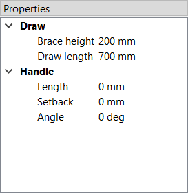
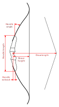

# Dimensions

The dimensions define some overall lengths and angles of the bow, including an optional stiff middle section.

<figure>
  
  <figcaption><b>Figure:</b> Dimensions</figcaption>
</figure>

**Draw**

- **Brace height:** Distance between the deepest point of the handle and the string at rest

- **Draw length:** Distance between the deepest point of the handle and the string at full draw

- **Nock offset:** Signed offset of the nocking point along the bow's longitudinal axis,
  positive towards the upper limb. Use this to model an asymmetric bow such as a yumi
  (typically `+L/6`); leave at zero for symmetric bows.

**Handle**

- **Length (upper):** Optional length of a stiff middle section between the upper limb and the grip
- **Length (lower):** Optional length of a stiff middle section between the lower limb and the grip

- **Setback:** Distance between the deepest point of the grip and the attachment point of the limbs to the middle section

- **Angle:** Angle at which the limbs are attached to the middle section

> **Note:** Starting with version 0.11.0 the handle has independent upper and lower
> lengths so the grip does not have to sit at the middle of the bow.

See the image below for a visual definition of the dimensions.

<figure>
  
  <figcaption><b>Figure:</b> Definition of the dimensions</figcaption>
</figure>