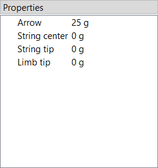

# Masses

Here you can set the mass of the arrow as well as some other optional masses.

<figure>
  
  <figcaption><b>Figure:</b> Mass properties</figcaption>
</figure>

Only the mass of the arrow is actually required.
The other ones account for optional weights at various points of the bow and may be set to zero if not needed.
Masses in general only have an effect in dynamic analysis.

- **Arrow:** Mass of the arrow

- **Limb tip (upper):** Additional mass at the upper limb tip (e.g. tip overlay, extending nock)

- **Limb tip (lower):** Additional mass at the lower limb tip

- **String nock:** Additional mass at the nocking point of the string (e.g. serving, nock loop)

- **String tip (upper):** Additional mass at the upper end of the string (e.g. serving)

- **String tip (lower):** Additional mass at the lower end of the string

> **Note:** Starting with version 0.11.0 the upper and lower limb tips and string tips are
> specified independently to support fully asymmetric bow designs (e.g. yumi).
> For symmetric bows just set the upper and lower values to the same number.